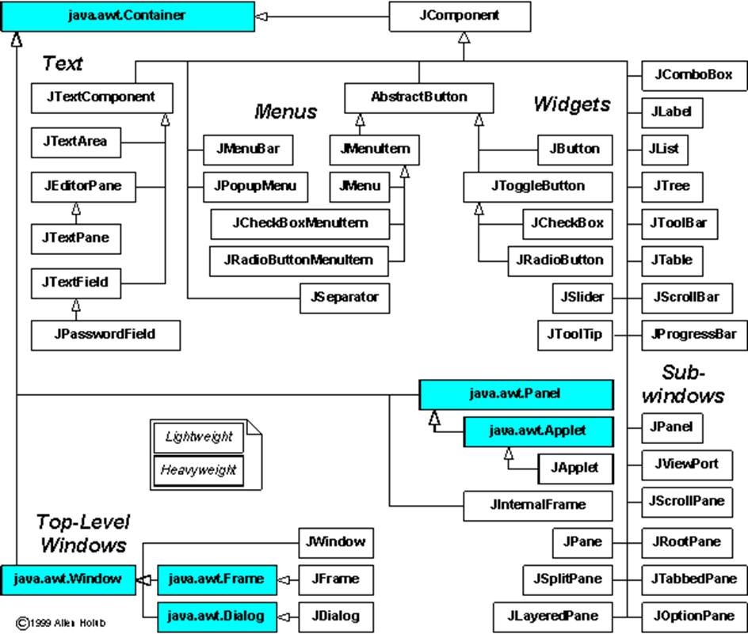

# Graphical User Interface (GUI)
## Разработка графического интерфейса пользователя в Java c технологией Swing

В Java содержится два пакета для создания оконного пользовательского интерфейса: AWT и его надстройка Swing. 

Первой попыткой Sun создать графический интерфейс для Java была библиотека AWT (Abstract Window Toolkit) - инструментарий для работы с различными оконными средами. Sun сделал прослойку на Java, которая вызывает методы из библиотек, написанных на С. Библиотечные методы AWT создают и используют графические компоненты операционной среды.

Вслед за AWT Sun разработала графическую библиотеку компонентов Swing. Набор стандартных компонентов значительно превосходит AWT по разнообразию и функциональности. Swing позволяет легко создавать новые компоненты, наследуясь от существующих, и поддерживает различные стили и модификации. Но тем не менее, Swing не заменяет AWT, а наоборот расширяет и использует его наиболее «легковесные» компоненты.


В составе Swing можно выделить составляющие:
1. Окна (top level containers): 
* JFrame – окно приложения;
* JDialog – диалог приложения;
* JApplet – главное окно апплета и пр.;
2. Контейнеры, позволяющий располагать и комбинировать компоненты: 
- JPanel – простая панель для группировки элементов, включая вложенные панели; 
- JToolBar – панель инструментов (обычно это кнопки);
- JScroolPane — панель прокрутки, позволяющая прокручивать содержимое дочернего элемента и пр.;
3. Компоновщики, задающие «схему» расположения компонентов на панели(окне): по умолчанию BorderLayout – размещает элементы в один из пяти регионов, как было указано при добавлении элемента в контейнер: наверх, вниз, влево, вправо, в центр; кроме него FlowLayout, GridLayout, BoxLayout, SpringLayout, GroupLayout, которые можно задать через ```setLayout([new компоновщик])```, или ```setLayout(null)``` чтобы отказаться от них вовсе;
4. Компоненты (виджеты), с которыми непосредственно может взаимодействовать пользователь: 
- JLabel – метка, надпись;
- JButton – кнопка; 
- JComboBox – выпадающий список;
- JCheckBox – кнопка-флажок; 
- JRadioButton – переключатели, радио-кнопки, обычно используется с компонентом ButtonGroup; 
- JTextField — однострочное текстовое поле и многие другие;
5. События, связанные с действиями пользователя: 
- ActionEvent – событие, определяемое компонентом, например нажатие кнопки; 
- ItemEvent – событие выбора или отменены выбора элемента; 
- KeyEvent – событие ввода с клавиатуры; 
- MouseEvent – события мыши; 
- WindowEvent – события окна, как активация и свертывание и многие другие.

Для того чтобы «отследить» то или иное событие, связанное с элементом, необходимо добавить «слушатель» (listener) соответствующего события и закрепить связанный с ним ответ - действие. Например: ```button.addActionListener ([new листенер])```

Для того, чтобы создать интерфейс пользователя на Swing, необходимо:
* Создать экземпляр окна (JFrame) и описать его размеры, положение и задать видимость. Опционально задается заголовок, иконка, визуальное оформление и поведение при закрытии окна:
```
Frame frame = new JFrame("GUI");    // Десктопное окно
frame.setDefaultCloseOperation(JFrame.EXIT_ON_CLOSE); // Cтандартное поведение при закрытии окна - завершение приложения
frame.setSize(300, 300);            // Размеры окна
frame.setLocationRelativeTo(null);  // Положение: окно - в центре экрана
frame.setVisible(true);             // Делаем окно видимым
```
* Создать компоненты и разместить их на окне (с помощью контейнеров и/или компоновщиков):
```
JButton button = new JButton("Press");  // Экземпляр класса JButton
Container container = getContentPane()  // Область окна
// container.add(button);               // Добавляем кнопку на окно - займет все пространство
container.add(BorderLayout.NORTH, button); // Добавляем кнопку на окно - окажется сверху
```

## Для ознакомления:
* [docs.oracle.com/uiswing](https://docs.oracle.com/javase/tutorial/uiswing/TOC.html)
* [pro-prof.com/java-swing-основы](https://pro-prof.com/forums/topic/java-swing-%D0%BE%D1%81%D0%BD%D0%BE%D0%B2%D1%8B)
* [java-online.ru/libs-swing](https://java-online.ru/libs-swing.xhtml)